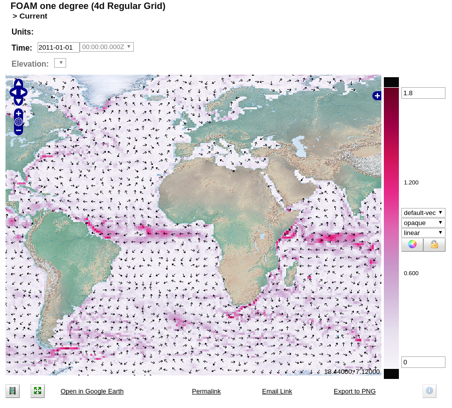
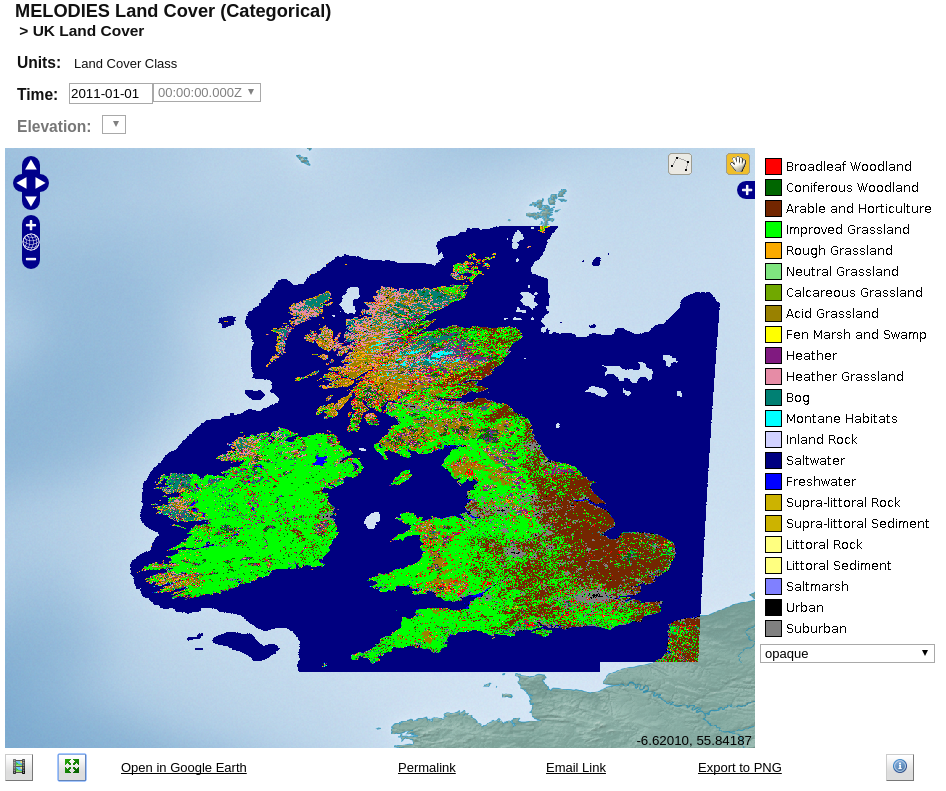

# Data Formats

Whilst focused primarily on reading NetCDF data, ncWMS uses the [Unidata NetCDF Java libraries](http://www.unidata.ucar.edu/software/thredds/current/netcdf-java/) to do so, and hence supports a number of different [file formats](http://www.unidata.ucar.edu/software/thredds/current/netcdf-java/reference/formats/FileTypes.html). The detail of all of these file format is beyond the scope of this guide. This section outlines the metadata conventions which ncWMS supports within any of these formats.

## CF (Climate and Forecast) Conventions {#cf}
The [CF conventions](http://cfconventions.org/) are the primary standard used in ncWMS. Environmental data should follow these conventions if they are to be displayed correctly in ncWMS. In particular, co-ordinate axes are identified by their units, and the omission of units on a co-ordinate axis will most likely lead to data not being available in ncWMS.

There are CF compliance checkers available from the [CF conventions website](http://cfconventions.org/compliance-checker.html).

## Vector Data {#vector}
Vector data in NetCDF files is usually stored in terms of the vector components.  As per the CF conventions each variable should, if possible, define an attribute of `standard_name` from the [CF standard name table](http://cfconventions.org/Data/cf-standard-names/33/build/cf-standard-name-table.html) to denote what the variable represents.

Provided that the `standard_name` components are of the form `.*eastward_.*`/`.*northward.*` or `u-.*component`/`v-.*component`, ncWMS will automatically detect that these are vector fields. It will group these variables together under a parent group which will also contain dynamically-generated fields for the magnitude and direction. Clicking the parent group in [Godiva3](04-usage.md#godiva3) will plot both magnitude and direction simultaneously, with a number of different styles available.



## Categorical Data {#categorical}
There is also support for categorical data in ncWMS. This uses the CF-defined attributes `flag_values` and `flag_meanings`. As per the CF-conventions, `flag_values` should contain a comma-separated list of the valid numerical values for the categorical data. `flag_meanings` should contain a single string with space-separated identifiers of what these values represent.  In `flag_meanings`, underscores should be used to separate words in a single description - these will then be converted to spaces for display.

Additionally we define another 2 optional attributes for use with categorical data.  The first, `flag_namespace` will be prepended to all of the `flag_meanings` values in the category ID in the Parameter. Whilst this is not currently used in ncWMS, it is exposed by the EDAL libraries and may be used to define unique identifiers for categorical data for use in e.g. linked-data applications.

The second optional attribute is the `flag_colours` attribute, which should contain a list of space-separated colour definitions. These will be used as the default colours for visualising categorical data in ncWMS.  A full set of categorical attributes will appear similar to this in the CDL description of the dataset:

```
    land_cover:flag_values = 1, 2, 3, 4, 5, 6, 7, 8, 9, 10, 11, 12, 13, 14, 15, 16, 17, 18, 19, 20, 21, 22, 23 ;
    land_cover:flag_namespace = "http://melodiesproject.eu/datasets/WP3/land-cover/def#" ;
    land_cover:flag_meanings = "Broadleaf_Woodland Coniferous_Woodland Arable_and_Horticulture Improved_Grassland Rough_Grassland Neutral_Grassland Calcareous_Grassland Acid_Grassland Fen_Marsh_and_Swamp Heather Heather_Grassland Bog Montane_Habitats Inland_Rock Saltwater Freshwater Supra-littoral_Rock Supra-littoral_Sediment Littoral_Rock Littoral_Sediment Saltmarsh Urban Suburban" ;
    land_cover:flag_colors = "#FF0000 #006600 #732600 #00FF00 #FAAA00 #7FE57F #70A800 #998100 #FFFF00 #801A80 #E68CA6 #008073 #00FFFF #D2D2FF #000080 #0000FF #CCB300 #CCB300 #FFFF80 #FFFF80 #8080FF #000000 #808080" ;
``` 

